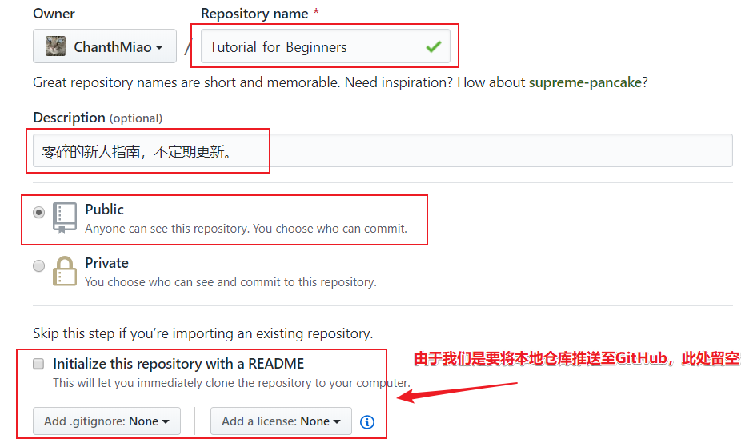

# 如何推送新项目至GitHub仓库

## 软件依赖

- git

### 直接使用包管理器安装

- Debian 系

    ```shell
    sudo apt install git
    ```

- Arch 系

    ```shell
    sudo pacman -Syu git
    ```

- MacOS

    ```shell
    brew install git
    ```

### 使用官方提供的安装包

[git安装包下载页面](https://git-scm.com/downloads)

## 为git提供基本全局设置

git安装完毕后，需要提供最基本的用户信息。通常，你至少需要执行以下两条命令。

```shell
git config --global user.name "你的用户名"
git config --global user.email "你的邮箱"
```

**更多详细设置项，请参考[官方帮助文档](https://git-scm.com/book/zh/v1/起步-初次运行-Git-前的配置)**

## 注册GitHub账户

***如果，你已经拥有GitHub账户，请跳过这一段。***

移步[GitHub主页](https://github.com)。注册账号。

## 新建仓库

现在，假定你已经成功登录GitHub。

- 如下图，我们可以从用户菜单跳转至个人仓库管理页面。

  

- 选择新建仓库

  

- 提供必要仓库信息

  

- 确认信息无误，完成Github仓库创建。若一切正常，你将看见如下图所示页面。

  

## 初始化本地仓库

- 定位至你的本地项目根目录（方法如下，二选一）。
  - 任意处打开终端，然后使用`cd`命令进入本地项目的根目录。
  - 直接在根目录打开终端。
- 初始化一个空的git仓库
  
  ```shell
  git init
  ```

## 完善相关材料

- 提供.gitignore文件，用于排除不相干文件。以本项目为例，文件内容如下。

  ```txt
  .vscode
  ```

- 为项目添加一份许可证（可选，推荐）。至于如何选择，请移步至<https://choosealicense.com>。
  - 本项目选择MIT协议。
    
  - 将协议副本存放在项目根目录。

- 为项目提供一份[README](../README.md)（可选，推荐）。

## 提交并推送

- 将项目文件提交至git。
  - 以本项目为例

  ```shell
  git add --all # 暂存所有未被.gitignore文件排除的资源
  git commit -m "First commit"
  ```

- 添加Github仓库为远程仓库并推送本地仓库.
  - 以本项目为例

  ```shell
  git remote add origin https://github.com/ChanthMiao/Tutorial_for_Beginners.git
  git push -u origin master
  ```

  ***如果你的git并没有记录过GitHub登录凭据（Windows下的git可以使用系统提供的凭据管理器），则需要提供账号和口令***

## 大功告成

至此，你已经完成了本地项目至GitHub新仓库的推送。
